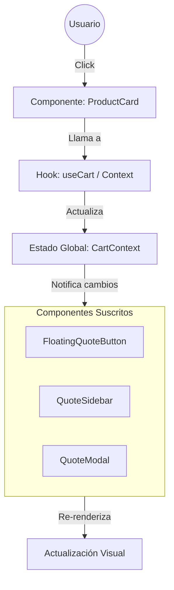

# Arquitectura del Proyecto Linda Plast Catalogs

Este documento detalla la estructura, funcionalidad y flujo de comunicación de las diferentes capas del proyecto.

## 1. Estructura y Funcionalidad de Capas

El proyecto está estructurado siguiendo una arquitectura modular basada en React. A continuación se describe cada capa:

### 📂 `src/pages` (Capa de Vistas / Enrutamiento)
*   **Funcionalidad:** Contiene los componentes de nivel superior que representan rutas completas (páginas) de la aplicación.
*   **Importancia:** Es el punto de entrada visual para el usuario. Define qué se muestra según la URL (ej. Inicio, Página de Error). Orquesta la disposición de los componentes principales.
*   **Archivos Clave:** `Index.tsx` (Página principal), `NotFound.tsx` (Error 404).

### 📂 `src/components` (Capa de Presentación y Lógica UI)
*   **Funcionalidad:** Bloques constructivos de la interfaz.
    *   **Feature Components (Raíz de components):** Componentes complejos con lógica de negocio específica (ej. `ProductCatalog.tsx`, `QuoteModal.tsx`).
    *   **UI Components (`components/ui`):** Componentes atómicos y reutilizables (botones, inputs, tarjetas) que definen el diseño visual base (probablemente usando shadcn/ui o similar).
*   **Importancia:** Promueve la reutilización y consistencia visual. Separa la complejidad dividiendo la interfaz en partes manejables.

### 📂 `src/context` (Capa de Estado Global)
*   **Funcionalidad:** Gestiona datos que deben ser accesibles por toda la aplicación sin pasar "props" manualmente a través de muchos niveles (Prop Drilling).
*   **Importancia:** Vital para funcionalidades transversales como el **Carrito de Cotización**. Permite que el `ProductCard` agregue items y el `QuoteModal` los lea, sin que estén conectados directamente.

### 📂 `src/hooks` (Capa de Lógica Reutilizable)
*   **Funcionalidad:** Encapsula lógica de estado compleja o efectos secundarios que se comparten entre varios componentes.
*   **Importancia:** Mantiene los componentes limpios ("Clean Code"), extrayendo la lógica "sucia" (event listeners, cálculos complejos) en funciones separadas reutilizables.

### 📂 `src/data` (Capa de Datos Estáticos/Simulados)
*   **Funcionalidad:** Contiene la información de los productos, categorías o configuraciones estáticas.
*   **Importancia:** Centraliza la información. Si se necesita cambiar un precio o descripción, se hace aquí y se refleja en toda la app. En el futuro, esto podría ser reemplazado por llamadas a una API.

### 📂 `src/lib` y `src/types` (Capa de Utilidades y Definiciones)
*   **Funcionalidad:**
    *   `lib/`: Funciones auxiliares puras (ej. formateadores de moneda, validadores, utilidades de clases CSS).
    *   `types/`: Definiciones de TypeScript interfaces/types.
*   **Importancia:**
    *   `lib` evita duplicación de lógica común.
    *   `types` asegura la robustez del código, previniendo errores de tipos y mejorando el autocompletado (DX).

---

## 2. Flujo de Comunicación

La comunicación en la aplicación sigue un flujo **Unidireccional (One-Way Data Flow)** típico de React, complementado por el **Patrón de Contexto** para estado global.

### Flujo Típico: Interacción del Usuario (Ejemplo: Agregar al Carrito)

1.  **Evento de Usuario:**
    *   El usuario hace clic en "Agregar" en el componente `ProductCard` (`src/components/ProductCard.tsx`).

2.  **Disparo de Acción (Action Dispatch):**
    *   El componente `ProductCard` no modifica el estado directamente.
    *   Llama a una función expuesta por el Contexto (ej. `addToCart`) o un Hook (ej. `useCart`).

3.  **Actualización de Estado (State Update - Context Layer):**
    *   El `CartContext` (`src/context`) recibe la acción.
    *   Actualiza su estado interno (lista de items seleccionados).

4.  **Propagación de Cambios (Re-render):**
    *   React detecta el cambio en el Contexto.
    *   Notifica a todos los componentes "suscritos" a este contexto.

5.  **Actualización de UI (View Update):**
    *   `FloatingQuoteButton` (`src/components/FloatingQuoteButton.tsx`) recibe la nueva cuenta de items y se actualiza visualmente (ej. muestra "3" en el badge).
    *   `QuoteSidebar` (`src/components/QuoteSidebar.tsx`) recibe la nueva lista y muestra el producto agregado.

### Diagrama Simplificado

## 3. Resumen de Importancia Arquitectónica

*   **Modularidad:** Permite trabajar en el "Header" sin romper el "Catálogo".
*   **Escalabilidad:** Se pueden agregar más páginas (`pages`) o productos (`data`) sin reestructurar la app.
*   **Mantenibilidad:** La lógica fuerte está en `hooks/context`, la visual en `components`, y los datos en `data`, facilitando encontrar y arreglar bugs.
